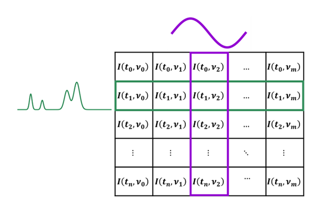

# PyMESpec

[](https://github.com/worradal/PyMESpec/actions/workflows/test-coverage.yml)
[](https://codecov.io/gh/worradal/PyMESpec)

PyMESpec is designed to be an encompassing software package for the analysis of transient experimental spectroscopic data, with an emphasis in aiding labratory automation, through automated data analysis.



## Setup and Installation

Before running any scripts or the GUI, you need to set up your Python environment and install the package:

1. **Clone the repository:**
   ```bash
   git clone https://github.com/worradal/PyMESpec
   cd PyMESpec
   ```


2. **(Optional but recommended) Create a virtual environment:**
    - Using **conda**:
       ```bash
       conda create -n pymespec python=3.11
       conda activate pymespec
       ```

3. **Install the package and all dependencies:**
   ```bash
   pip install .
   ```

## Ways to perform data analysis

There are three main ways to analyze spectra:

1. **Python scripting**
   - The primary workflow is to use Python scripts for analysis. See the example scripts in `src/example_files/jupyter_notebook_tutorials/` for examples of how to perform different analysis sets.

2. **Command line interface**
   - Run analyses using a configuration YAML or JSON file for reproducible, automated workflows.

3. **Graphical User Interface (GUI)**
   - Use the GUI for a user-friendly, point-and-click experience with simplified versions of the analyses directly from the interface. The GUI will also generate both YAML and JSON files.


## Method 1: Scripting
### Jupyter Notebook Tutorials

For hands-on learning and examples of how to code with the PyMESpec package, see the interactive Jupyter notebook tutorials in `src/example_files/jupyter_notebook_tutorials/`:

- `synthetic_tutorial.ipynb` - Comprehensive synthetic tutorial demonstrating all core functionality including data processing, baseline correction, chemometrics, phase analysis, and rate data extraction.
- `V_TiO2_tutorial.ipynb` - Tutorial to accompany the manuscript involving propane dehydrogenation over a vanadium oxide supported on titania catalyst.
- `computing_pure_components_tutorial.ipynb` - This tutorial takes you through the calculation of pure component reference spectra based on known fractions of contribution to composite spectra.
- `CeO2_DRIFTS_tutorial.ipynb` - This tutorial showcases the base functionality of baseline correction as applied to CeO2 drifts data, showcasing the impact of tuning parameters.
- `CeO2_DRIFTS_custom_baseline_tutorial.ipynb` - An example way for the user to define custom baseline correction classes as a way to extend the features of this toolbox.


## Configuration File Formats

PyMESpec uses a flexible configuration system that supports both YAML and JSON formats. Configuration files define analysis parameters, data locations, and processing options.


The package supports two configuration file formats:

1. **YAML format** (`.yaml`, `.yml`) - Human-readable, ideal for manual editing
2. **JSON format (clean)** (`.json`) - Lightweight JSON similar to YAML structure  


### Generating Initial Configuration Files

#### Method 2: Using Tutorial Examples

If you opt instead for the command line interface, the fastest way to generate example configuration files is to run the tutorial example scripts.

```bash
# For Chemometrics analysis
python src/example_files/chemometrics_example.py

# For Phase analysis
python src/example_files/phase_example.py

# For Rate Data analysis
python src/example_files/rate_data_example.py

# For Baseline Correction analysis
python src/example_files/baseline_correction_example.py
```

### Loading and Running Analysis

Once you have a configuration file, you can run analysis by:

```bash
python pymespec.py /path/to/configuration/file.yaml
# or
python pymespec.py /path/to/configuration/file.json
```

---

## Configuration (quick note)

You can use either the example-style "clean" YAML/JSON files or the GUI's saved JSON files. For most users:

- If you use the example scripts, keep the generated clean YAML/JSON and run them with the CLI or load them into the GUI.
- If you save a JSON from the GUI and then re-use it, the tools will handle it correctly.

If you run into missing-column or parsing errors, check the CSV header row and the Frequency/Intensity column names in your config to ensure that they match.

---

#### Method 3: Using the GUI

1. Launch the GUI application
2. Configure your analysis parameters through the interface
3. When the Run button is clicked the GUI saves both JSON and YAML formats for future reading and script adjustment along with the data you process.


## See the example files folder for reference for each of the main modules
1. Baseline correction
2. Chemometrics  
3. Phase sensitive detection
4. Automated Rate abstractions

### Dependencies
* numpy
* scipy
* pandas
* matplotlib
* seaborn
* natsort
